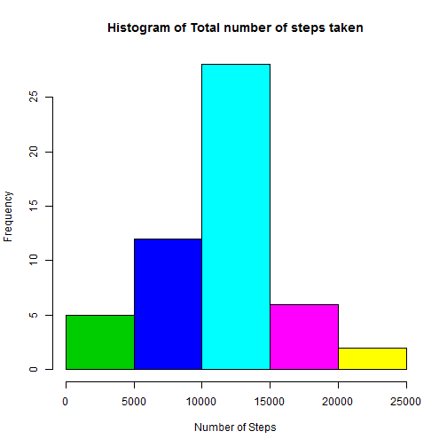
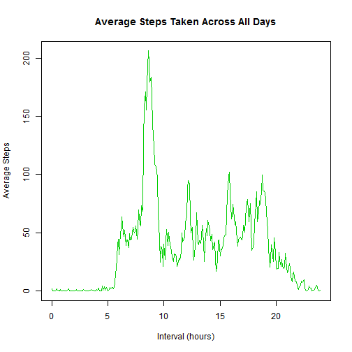
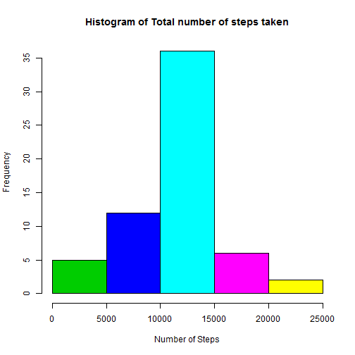
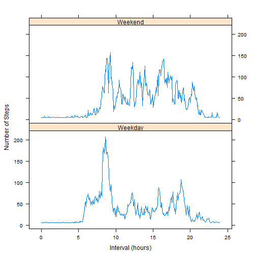

## Loading and preprocessing the data
As a first step, read.csv() function is used to load the activity.csv file to a variable called ractivity. Take a look at the data using head() and tail() functions.

```r
ractivity <- read.csv("activity.csv")
head(ractivity)
```

```
##   steps       date interval
## 1    NA 2012-10-01        0
## 2    NA 2012-10-01        5
## 3    NA 2012-10-01       10
## 4    NA 2012-10-01       15
## 5    NA 2012-10-01       20
## 6    NA 2012-10-01       25
```

```r
tail(ractivity)
```

```
##       steps       date interval
## 17563    NA 2012-11-30     2330
## 17564    NA 2012-11-30     2335
## 17565    NA 2012-11-30     2340
## 17566    NA 2012-11-30     2345
## 17567    NA 2012-11-30     2350
## 17568    NA 2012-11-30     2355
```
Use summary() and str() functions to view more information about the data.

```r
summary(ractivity)
```

```
##      steps                date          interval     
##  Min.   :  0.00   2012-10-01:  288   Min.   :   0.0  
##  1st Qu.:  0.00   2012-10-02:  288   1st Qu.: 588.8  
##  Median :  0.00   2012-10-03:  288   Median :1177.5  
##  Mean   : 37.38   2012-10-04:  288   Mean   :1177.5  
##  3rd Qu.: 12.00   2012-10-05:  288   3rd Qu.:1766.2  
##  Max.   :806.00   2012-10-06:  288   Max.   :2355.0  
##  NA's   :2304     (Other)   :15840
```

```r
str(ractivity)
```

```
## 'data.frame':	17568 obs. of  3 variables:
##  $ steps   : int  NA NA NA NA NA NA NA NA NA NA ...
##  $ date    : Factor w/ 61 levels "2012-10-01","2012-10-02",..: 1 1 1 1 1 1 1 1 1 1 ...
##  $ interval: int  0 5 10 15 20 25 30 35 40 45 ...
```


## What is mean total number of steps taken per day?
Assign to a new variable without the missing values (NAs) and use tapply() to get total steps per day. 

```r
rmna_activity <- ractivity[!is.na(ractivity$steps),]
tapply(rmna_activity$steps,rmna_activity$date, sum)
```

```
## 2012-10-01 2012-10-02 2012-10-03 2012-10-04 2012-10-05 2012-10-06 
##         NA        126      11352      12116      13294      15420 
## 2012-10-07 2012-10-08 2012-10-09 2012-10-10 2012-10-11 2012-10-12 
##      11015         NA      12811       9900      10304      17382 
## 2012-10-13 2012-10-14 2012-10-15 2012-10-16 2012-10-17 2012-10-18 
##      12426      15098      10139      15084      13452      10056 
## 2012-10-19 2012-10-20 2012-10-21 2012-10-22 2012-10-23 2012-10-24 
##      11829      10395       8821      13460       8918       8355 
## 2012-10-25 2012-10-26 2012-10-27 2012-10-28 2012-10-29 2012-10-30 
##       2492       6778      10119      11458       5018       9819 
## 2012-10-31 2012-11-01 2012-11-02 2012-11-03 2012-11-04 2012-11-05 
##      15414         NA      10600      10571         NA      10439 
## 2012-11-06 2012-11-07 2012-11-08 2012-11-09 2012-11-10 2012-11-11 
##       8334      12883       3219         NA         NA      12608 
## 2012-11-12 2012-11-13 2012-11-14 2012-11-15 2012-11-16 2012-11-17 
##      10765       7336         NA         41       5441      14339 
## 2012-11-18 2012-11-19 2012-11-20 2012-11-21 2012-11-22 2012-11-23 
##      15110       8841       4472      12787      20427      21194 
## 2012-11-24 2012-11-25 2012-11-26 2012-11-27 2012-11-28 2012-11-29 
##      14478      11834      11162      13646      10183       7047 
## 2012-11-30 
##         NA
```
Let's make a histogram of the total number of steps per day.

```r
 hist(tapply(rmna_activity$steps,rmna_activity$date, sum),main ="Histogram of Total number of steps taken", xlab="Number of Steps",col=c(3:7))
```

 

Apply mean() and median() functions on the total steps per day.

```r
mean(tapply(rmna_activity$steps,rmna_activity$date, sum),na.rm = TRUE)
```

```
## [1] 10766.19
```

```r
median(tapply(rmna_activity$steps,rmna_activity$date, sum),na.rm = TRUE)
```

```
## [1] 10765
```


## What is the average daily activity pattern?
Using aggregate() function to get average steps taken across all days and make a time series plot. Convert the interval into hours to get a proportionate scale.


```r
avstep <- aggregate(steps ~ interval, mean, data=ractivity, rm.na =TRUE)
avstep$hr <- (avstep$interval %/% 100) + (avstep$interval %% 100)/60
plot(avstep[,3],avstep[,2], type="l", xlab = "Interval (hours)", ylab="Average Steps", main ="Average Steps Taken Across All Days", col=3)
```

 

To find the 5-minute interval, on average across all the days in the dataset,which contains the maximum number of steps,

```r
avstep[round(avstep[,2],2) == round(max(avstep[,2]),2),]
```

```
##     interval    steps       hr
## 104      835 206.1698 8.583333
```
## Imputing missing values

To find the missing values (NAs) in the data set,

```r
sum(is.na(ractivity[,1]))
```

```
## [1] 2304
```
To assign average of average number of steps taken for 5-minute interval across all days to the missing values,

```r
nactivity <- ractivity
nactivity[is.na(nactivity[,1]),1] <- mean(avstep[,2])
```

Plot a histogram with newly created data set

```r
 hist(tapply(nactivity$steps,nactivity$date, sum),main ="Histogram of Total number of steps taken", xlab="Number of Steps",col=c(3:7))
```

 

Apply mean() and median() functions on the total steps per day on new data set

```r
mean(tapply(nactivity$steps,nactivity$date, sum))
```

```
## [1] 10766.19
```

```r
median(tapply(nactivity$steps,nactivity$date, sum))
```

```
## [1] 10766.19
```
Since the average is assigned to all the missing value, the new mean is the same as the mean from old data set.


## Are there differences in activity patterns between weekdays and weekends?

Add a new column to the data set nactivity and assign "Weekday" and "Weekend" accordingly. Convert that column as factor. Generate average steps taken across all days using aggregate function and assign to a variabl called navstep. Convert interval into hours and add as a new column to navstep.  


```r
nactivity$Wday <- rep(NA, nrow(nactivity))
nactivity[weekdays(as.Date(nactivity[,2])) %in% c("Saturday","Sunday"),4] <- "Weekend"
nactivity[!weekdays(as.Date(nactivity[,2])) %in% c("Saturday","Sunday"),4] <- "Weekday"
nactivity$Wday <- as.factor(nactivity$Wday)
navstep <- aggregate(steps ~ interval+Wday, mean, data=nactivity, rm.na =TRUE)
navstep$hr <- (navstep$interval %/% 100) + (navstep$interval %% 100)/60
```

Then make a panel plot using Lattice plotting system.

```r
library(lattice)
xyplot(steps ~ hr | Wday, data = navstep, layout = c(1,2), type = "l", xlab = "Interval (hours)",ylab = "Number of Steps")
```

 

We can see from the graph that during the weekend the activity is spread out the whole day.  During the weekday, the activity level peaks just before the office hour --most probably caused by the commute to work.
